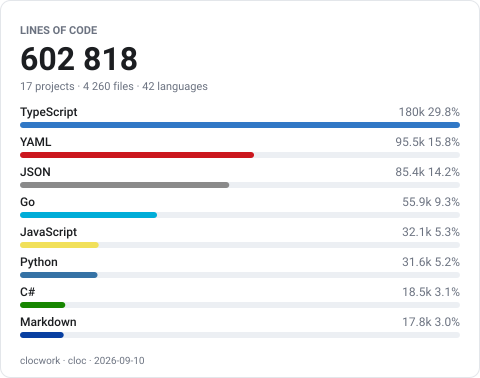
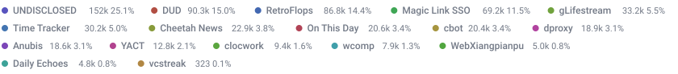

# clocwork

Counts lines of code across a fixed list of projects with
[cloc](https://github.com/AlDanial/cloc) and renders one combined report, per
language, per project, and in total.





Real output, from the author's own project list. The card above is the `bars`
layout over languages, the band under it is `strip` over projects. Private
projects are counted, then folded into one anonymous row. All six layouts,
drawn both ways, are in the [gallery](docs/gallery.md).

Output goes to `out/`, every file prefixed `cw-`:

| File | Use |
| --- | --- |
| `cw-report.txt` | terminal, plain text |
| `cw-report.md` | GitHub profile or repo README |
| `cw-report.html` | a page to drop on a website (self-contained, light + dark) |
| `cw-card-languages.svg` | summary badge for a profile README |

The SVG comes in six layouts, one file each, picked with `--layout`:

| Layout | File | Shape |
| --- | --- | --- |
| `card` (default) | `cw-card-languages.svg` | grand total, proportion bar, top rows |
| `strip` | `cw-strip-languages.svg` | a thin band of chips that wraps, no frame |
| `bar` | `cw-bar-languages.svg` | one proportion bar and a single line of labels |
| `bars` | `cw-bars-languages.svg` | the card header over a ranked bar per row |
| `donut` | `cw-donut-languages.svg` | a ring of shares with the total in the middle |
| `banner` | `cw-banner-languages.svg` | a headline over a ring and a bar, always 2:1 |

Each shape can be drawn over languages (the default) or over projects, picked
with `--by`. Both are named in the file, so `--layout strip --by all` writes
`cw-strip-languages.svg` and `cw-strip-projects.svg`. Language is the default of
`--by`, not a lesser variant of it, and a filename that says which subject it
drew beats one you have to know the convention to read. `--by` is an SVG
option. The TXT, Markdown and HTML reports carry both tables
already, and `--sections` picks between those.

## Requirements

- `cloc` (`brew install cloc`)
- Python 3.11 or newer (uses `tomllib` from the standard library)

The tool has no third-party runtime dependencies, so there is nothing to install
and `./bin/clocwork` runs straight from a checkout. It is also a
[uv](https://docs.astral.sh/uv/) project. `uv sync` creates `.venv` with the
package installed in editable mode and puts a `clocwork` command on the path.

## Install

```bash
brew install wojciechpolak/clocwork/clocwork
```

`cloc` comes with it. The formula installs the release wheel into a virtualenv
of its own, so nothing is built and pip never reaches PyPI. The tap is
[wojciechpolak/homebrew-clocwork](https://github.com/wojciechpolak/homebrew-clocwork).

An installed `clocwork` reads the `projects.toml` of the directory you run it
in and writes the report to `out/` beside that file, so a bare `clocwork` works
anywhere you keep a project list. In a checkout the two are the same place,
which is why `uv run clocwork` needs no flags either.

## Use

```
uv run clocwork                        # every format into out/
uv run clocwork --detail               # add the per-project, per-language breakdown
uv run clocwork --stdout md            # Markdown to stdout, write nothing
uv run clocwork --only aoc --detail    # one project
uv run clocwork --private              # only projects marked private
uv run clocwork --all                  # public and private together
uv run clocwork --mask                 # ...with the private ones anonymous
uv run clocwork --mask-each            # ...anonymous, but one row each
uv run clocwork --format md,svg        # just those two files
uv run clocwork --sections language    # the language table on its own
uv run clocwork --layout strip         # a thin band of languages instead of the card
uv run clocwork --layout card,donut    # two SVGs, one file each
uv run clocwork --layout all           # every SVG layout
uv run clocwork --by project           # the same shape, drawn over projects
uv run clocwork --by all               # both, one file each
uv run clocwork --svg-width 900        # widen the SVG, whichever layout
uv run clocwork --svg-rows 12          # label twelve rows, not six
uv run clocwork --svg-rows 0           # label every row there is
uv run clocwork --layout banner        # the wide 2:1 card
uv run clocwork --svg-title clocwork   # its headline; other layouts ignore it
uv run clocwork --sort name            # order rows alphabetically
uv run clocwork --date none            # no stamp, so a rerun changes nothing
uv run clocwork --no-fetch             # count cached clones, skip the network
uv run clocwork --cache ./clones       # keep the clones somewhere else
```

A standard run leads with two summary tables, By project and By language.
`--sections project` or `--sections language` keeps one of them. The default is
both. Nothing else moves. The totals stay the same, `--detail` still works, and
the SVG card is a language card either way.

`--date` sets how precise the generated-at stamp is: `minute` (the default),
`day`, `month`, or `none`. It is the only thing in the output that a rerun over
unchanged code changes by itself, so `--date none` is what makes two runs write
identical bytes. That is the setting for a scheduled run that commits what it
draws:

```bash
clocwork --quiet --date none --out docs/
git diff --quiet docs/ || git commit -m "chore: refresh the counts" docs/
```

Without it, the commit lands every time the job runs. `month` and `day` are the
softer versions, for a report that should still say roughly when it was made.

`./bin/clocwork` takes the same arguments and needs no virtualenv.

Exit status is `0` when everything counted, `1` when some projects were skipped
(the report is still written), and `2` when the run could not start.

## Configuration

The repository ships `projects.example.toml`. Copy it and edit the copy:

```bash
cp projects.example.toml projects.toml
```

`projects.toml` is gitignored, so the real paths and project names stay on your
machine. The example documents every key. A project's `repo` is either a
directory on this machine or a URL clocwork clones for you. A relative directory
resolves against `root`, which is itself relative to the config file, so the tool
works from any directory.

```toml
[defaults]
root = ".."
vcs = "git"
exclude_langs = []

[[project]]
repo = "aoc"
name = "Advent of Code"   # optional; defaults to the directory name

[[project]]
repo = "dotfiles"
url = "https://github.com/you/dotfiles"   # optional; makes the name a link
exclude_langs = ["JSON"]   # overrides the default for this project

[[project]]
repo = "https://github.com/you/repo.git"   # cloned into the cache
branch = "main"            # optional; the remote's default branch otherwise

[[project]]
repo = "secret-thing"
private = true             # counted only with --private, --all, or --mask
```

`[defaults]` keys: `root`, `cache`, `vcs`, `private`, `mask_label`,
`exclude_dirs`, `exclude_langs`, `cloc_args`. Every one except `root`, `cache`
and `mask_label` can be overridden per project. `repo`, `branch`, `name`, and
`url` are per project only.

A project with a `url` shows its name as a link in the Markdown and HTML
reports. The TXT report and the SVG card have nowhere to put one, so they are
unchanged. clocwork accepts only `http://` and `https://` links, and `--mask`
drops the url along with the name.

`url` is the project's home page and `repo` is what git clones. GitHub spells
the two almost alike, other hosts need not, so clocwork never guesses one from
the other.

### Counting a repository you have not checked out

Give `repo` a URL and clocwork clones it before counting:

```toml
[[project]]
repo = "https://github.com/you/repo.git"
branch = "main"
```

The clone is shallow (`--depth 1`) and single branch, and it stays on disk, so
only the first run pays for it. Later runs fetch the one commit that moved and
reset onto it. `--no-fetch` skips even that and counts what is already cached,
which is what you want offline; a project with no clone yet is still cloned,
since there is nothing else to count.

Clones live in `$XDG_CACHE_HOME/clocwork`, or `~/.cache/clocwork` when that is
unset. `[defaults] cache` moves them, and `--cache DIR` beats both. Each clone
gets a directory named after the repo and a digest of its URL and branch, so the
same repo on two branches is two clones, and repointing a project in the config
can never leave it counting the old remote.

`https://`, `http://`, `ssh://`, `git://` and `git@host:path` all work.
Credentials in a URL are stripped before it reaches an error message, a progress
line, or a directory name, so a token in a CI clone URL cannot end up in `out/`.

### In a GitHub workflow

Remote repos are the point of this. A runner has nothing checked out, so there
is nothing for a directory to point at.

Commit a `projects.toml` listing the repos you want counted, then:

```yaml
- uses: actions/checkout@v5
- run: |
    sudo apt-get install -y cloc
    pip install "clocwork @ git+https://github.com/wojciechpolak/clocwork"
- uses: actions/cache@v4
  with:
    path: .clocwork-cache
    key: clocwork-${{ hashFiles('projects.toml') }}
- run: >
    clocwork --config projects.toml --out out
    --cache .clocwork-cache --format svg --layout card
```

Cache the clone directory and the job clones once and fetches on every run
after. Point `--cache` at a path inside the workspace, since that is the only
place `actions/cache` can see.

Both flags are explicit above so the job decides its own workspace layout.
Left out, `--config` reads `projects.toml` from the working directory and
`--out` writes beside whichever config file it found.

### Public and private projects

A plain run counts only the projects that are not marked `private = true`, so
the report in `out/` is safe to publish. `--private` counts those projects
instead, and `--all` counts everything. Both write the same filenames as a
public run, so pass `--basename` or `--out` if you want to keep the two side by
side:

```
uv run clocwork --all --basename all    # out/cw-all.md instead of out/cw-report.md
```

`--only NAME` names a project outright, so it reaches a private one without
`--private`.

### Counting private code without naming it

`--mask` counts private projects and folds all of them into one row called
`UNDISCLOSED`, with no path, branch, url, or commit. The report shows how much
code there is without saying whose. It does not even say how many private
projects went into the row.

```
uv run clocwork --mask              # public projects, plus one UNDISCLOSED row
uv run clocwork --mask STEALTH      # call that row STEALTH instead
uv run clocwork --private --mask    # only the private ones, still anonymous
uv run clocwork --mask-each         # one anonymous row per private project
```

The grand total under `--mask` matches the one under `--all`. Only the names go
away. `--mask` on its own implies `--all`. To change the label for good rather
than per run, set it in the config:

```toml
[defaults]
mask_label = "STEALTH"
```

`--mask-each` keeps one row per private project instead of merging them,
numbered `UNDISCLOSED-1`, `UNDISCLOSED-2`, largest first. That gives away how
many private projects there are, in exchange for a per-project split. The names,
paths, branches, and urls still go away. It implies `--mask`, so it works on its own,
and `--mask STEALTH --mask-each` numbers your own label.

While counting, clocwork prints a progress line for every project, private ones
included. Those lines go to stderr, never into the report, so redirect them with
`2>/dev/null` if the terminal output is going somewhere public.

### Flag defaults

Put the flags you retype every run into a `[cli]` table and they become the
defaults, so a bare `clocwork` does what the long line did:

```toml
[cli]
layout = "all"
by = "all"
svg_rows = 8
svg_title = "clocwork"
```

Anything typed on the command line still wins, so `clocwork --layout card` draws
one shape whatever the table says. `--detail` and `--quiet` have no off switch
of their own, so `--no-detail` and `--no-quiet` turn a `true` in the table back
off for one run.

`[cli]` keys use underscores rather than hyphens: `format`, `layout`, `by`,
`sections`, `sort`, `detail`, `svg_rows`, `svg_width`, `svg_title`,
`svg_subtitle`, `basename`, `out`, `timeout`, `quiet`. A relative `out`
resolves against the config file, the way `root` does.

Visibility is not settable here, and naming `all`, `private`, `mask`,
`mask_each` or `only` in the table is an error. Those flags decide what leaves
your machine, so they belong on the line you type rather than in a file you
cannot see while typing it. `clocwork --mask` is still `clocwork --mask`.

### What gets counted

With `vcs = "git"` cloc counts only git-tracked files, so `node_modules`,
`dist`, and anything else in `.gitignore` never reaches it. Set
`vcs = "none"` to walk the directory tree instead.

Lock files *are* git-tracked, so they count by default and can dominate the
totals. `package-lock.json` alone is around 22k "JSON" lines in one project
here. Add `exclude_langs = ["JSON"]` to hide them.

## Embedding

Markdown for a profile README:

```
cat out/cw-report.md >> README.md
```

The SVG card as an image:

```markdown

```

It carries its own light and dark palettes, language colours included, fitted
to stay visible against the dark background. There is no external stylesheet, so
it stays readable in both GitHub themes.

`strip` and `bar` work differently. They draw no background, so the page
supplies one, and `prefers-color-scheme` describes the viewer rather than that
page. JetBrains' Markdown preview splits the two, rendering the SVG light while
painting the page dark. That left the language names at 1.13:1, which is to say
invisible. Both layouts now carry a single palette that clears the contrast
floor on white and on dark, and they ask for no theme at all.

`--layout` picks the shape, and each shape writes its own file, so a README can
carry more than one. `strip` is the one meant to sit under something else. It
has no frame and no totals, just the languages and their share, wrapped across
as many lines as it needs. Under a table of projects:

```markdown
| Project | Lines |
| --- | --- |
| ... | ... |


```

[docs/gallery.md](docs/gallery.md) has all six, drawn over languages and over
projects, from one real run. `./scripts/gallery` regenerates it.

`--basename` does not reach the SVG files. Each takes its layout's name and
its subject, so `--layout card,strip` writes `cw-card-languages.svg` and
`cw-strip-languages.svg` side by side. `bar` is
`strip` trimmed to a single bar and one line of labels. `bars`, `donut` and
`banner` are self-contained cards like `card` itself. `--svg-width` overrides
the width for whichever layout is drawn, and the wrapping ones re-wrap to fit.

`banner` is the only layout that takes text of its own. `--svg-title` sets a
headline above the total, `--svg-subtitle` a line under it. Leave them out and
the block is shorter. Nothing else moves. The other five accept both flags and
ignore them, the way `strip` and `bar` accept `--svg-rows`. They have nowhere
to put a headline. Their `LINES OF CODE` labels the figure beneath it rather
than naming the card.

`banner` is also the only layout with a locked shape. The rest grow taller as
they list more rows. This one is always twice as wide as it is tall, so
`--svg-width 640` draws the same picture at 640x320.

`--svg-rows` sets how many rows get a label. Six by default, `0` for all of
them. `card`, `bars` and `donut` are the three that keep a list, and they grow
taller to hold it. `banner` labels at most that many, and fewer when its one
line of chips runs out of room. The proportion bar and the donut ring still
cover everything counted, so the cap changes which rows get a name and never
what the picture measures. `strip` and `bar` ignore it. They draw every row
already, and collapse whatever will not fit into `+N more` and `other N%`.

## Tests

```
uv run pytest
```

The tests are plain `unittest` cases, so `python -m unittest discover -s . -p
"test_*.py"` runs them too, with nothing installed.

Linting and type checking use [ruff](https://docs.astral.sh/ruff/) and
[ty](https://github.com/astral-sh/ty), installed by `uv sync` as the `dev`
dependency group:

```
uv run ruff check .
uv run ty check .
```

All three at once, as one summary:

```
./scripts/check
```

It runs the linter, the type checker and the suite whatever the others do, and
exits non-zero if any of them failed. Ruff covers `bin/` and `scripts/` as well
as the package, through `extend-include` in `pyproject.toml`, since neither
script has a `.py` extension for it to find.

Everything under `scripts/` is for working on the repository. `bin/` holds only
`clocwork` itself.

## Credits

Two programs make a report, and the outputs say so: clocwork draws them, and
[cloc](https://github.com/AlDanial/cloc) counts the lines. The framed SVG
layouts carry `clocwork · cloc · <date>` in the footer; the text formats add
both version numbers, and Markdown and HTML link both names; `strip` and `bar`
carry nothing, because they are meant to sit under other content.

- `cloc` is by Al Danial, licensed GPL-2.0. clocwork runs it as a separate
  process and includes none of its code.
- The language colours in `LANGUAGE_COLORS` come from
  [GitHub linguist](https://github.com/github-linguist/linguist) (MIT), fitted
  for contrast against the dark card. Anything unlisted gets a hue derived from
  the language name.

## License

GPL-3.0-or-later. See [LICENSE](LICENSE); every source file carries the
matching SPDX header.

The reports it writes are not GPL. clocwork copies parts of itself into its
output, since every SVG layout carries a stylesheet, the HTML report carries a
larger one, and the signed formats carry a footer, and those files exist to be
pasted into READMEs and web pages under whatever licence those carry. So
[LICENSE](LICENSE) opens with an additional permission under section 7 of the
GPL: the TXT, Markdown, HTML and SVG that clocwork generates may be used and
distributed under terms of your choice, and the licence covering clocwork does
not reach them. Embed `cw-card-languages.svg` in a proprietary repository
without thinking about it.

That covers the ordinary case completely. Generate the HTML report, host it,
restyle it, ship it in the documentation of something commercial, and the GPL
has nothing to say about any of it. The same holds for the card, the Markdown
table and the plain text.

One loophole stays closed. `--stdout html` prints clocwork's whole stylesheet,
so a generated report doubles as a way to copy source out of the program.
Using a report as a report is what the permission is for. Using one to lift the
renderer into another line-count tool is not, and that case stays under the
GPL.
