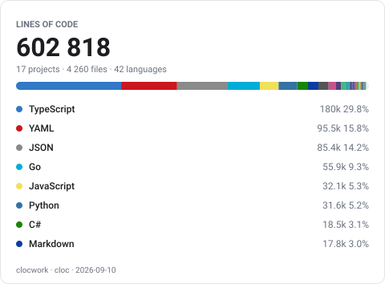
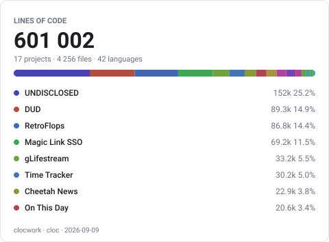
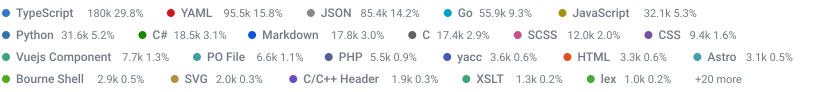
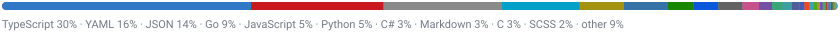
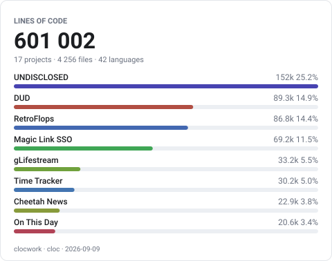
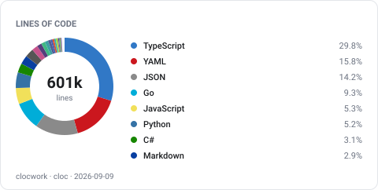
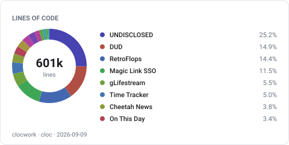
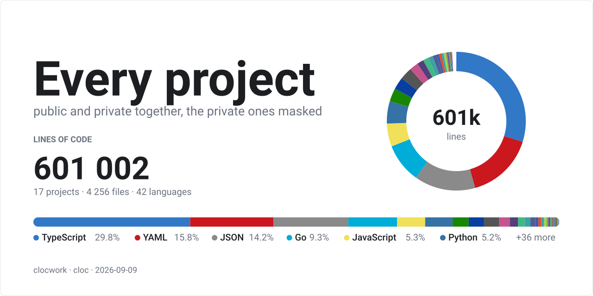
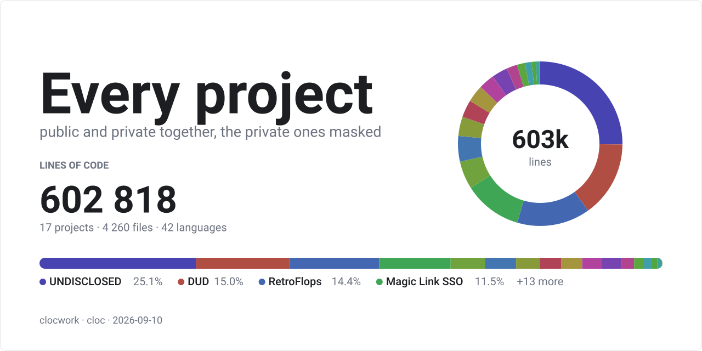

<!-- Generated by scripts/gallery. Edit that script, not this file. -->

# Gallery

Every shape clocwork draws, from one real run of:

```
clocwork --mask --layout all --by all --svg-rows 8 --svg-title 'Every project' --svg-subtitle 'public and private together, the private ones masked' --out docs/gallery
```

Real counts, from every project on the author's machine. `--mask` folded the private ones into a single `UNDISCLOSED` row with no name, path, branch or url, so the totals include private code without naming any of it. `./scripts/gallery` regenerates the lot.

Each layout is drawn twice, over languages by default and over projects with `--by project`. Every SVG carries its own light and dark palette, so they follow the GitHub theme.

## card

The default. Grand total, a proportion bar, and the top rows underneath.

**By language** (`cw-card-languages.svg`)



**By project** (`cw-card-projects.svg`)



## strip

A thin band of chips that wraps to as many lines as it needs. No frame and no totals, so it sits under other content.

**By language** (`cw-strip-languages.svg`)



**By project** (`cw-strip-projects.svg`)


## bar

One proportion bar with a single line of labels below it. `strip` trimmed to its shortest form.

**By language** (`cw-bar-languages.svg`)



**By project** (`cw-bar-projects.svg`)


## bars

The card header over a ranked bar per row, longest first.

**By language** (`cw-bars-languages.svg`)


**By project** (`cw-bars-projects.svg`)



## donut

A ring of shares with the grand total in the middle.

**By language** (`cw-donut-languages.svg`)



**By project** (`cw-donut-projects.svg`)



## banner

A heading block, a ring, and a proportion bar across the foot, always twice as wide as it is tall. The only layout that takes text of its own. `--svg-title` and `--svg-subtitle` wrote the two lines on the left.

**By language** (`cw-banner-languages.svg`)



**By project** (`cw-banner-projects.svg`)



## The text formats

The same run, rendered for reading rather than embedding.

- [cw-report.md](gallery/cw-report.md), the Markdown report, which GitHub renders inline
- [cw-report.txt](gallery/cw-report.txt), the plain text report, for a terminal
- [cw-report.html](gallery/cw-report.html), one self-contained page in light and dark. GitHub shows its source, so download it to look
